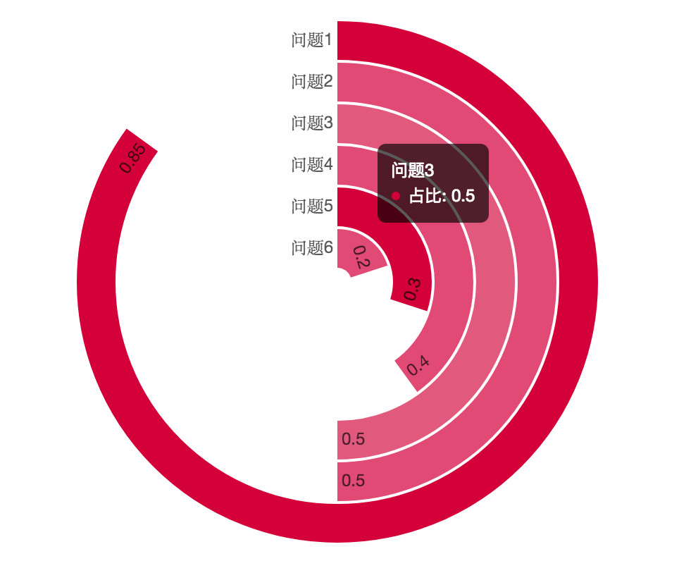

# react-radial-bar-chart
环形柱状图(玉玦图) by canvas

### How to use
```javascript
import RadialBarChart from 'react-radial-bar-chart';

<RingBarChart />

```
### RadialBarChart Props
```javascript
{
  list: [ // example
    { name: 'Q1', percent: 0.5, backgroundColor: '' },
    { name: 'Q2', percent: 0.4 },
    { name: 'Q3', percent: 0.3 },
    { name: 'Q4', percent: 0.2 },
  ],
  lineWidth: 20, // default
  width: 250,  // default
  height: 250,  // default
  radius: 100,  // default
  onClick: (e, ringInfo), // default
  onHover: (e, ringInfo), // default
  onHover: ({ ratio, clientWidth, clientHeight, ratioWidth, ratioHeight }, e), // default
  title: '',
  isGradient: false,
  labelStyle: '#333',
  dataStyle: '#fff',
  tooltip: {  // default
    show: true,
    formatter: (ringInfo) => {
      return `占比: ${ringInfo.percent*100}%`;
    }
  },
  tooltipStyle: {
    backgroundColor: 'rgba(0,0,0,0.65)',
    ...
  },
}
```

### Base Package
[color-conversion-rgb](https://github.com/justQing00/color-conversion)

[react-chart-canvas](https://github.com/justQing00/react-chart-canvas)

### Inspiration From

In a project I have to make a React `RadialBarChart` compoment, and I found [radial-bar](http://antv.alipay.com/g2/demo/16-polar/radial-bar.html). But its `name` is not centered. Also I do not need import all of it just for `radial-bar`, so I write one.



### CheckList

### Changelog
##### 0.1.3
* Split code to `color-conversion-rgb`、`react-chart-canvas`

##### 0.1.2
* Gradient color

##### 0.1.1
* draw single ring (finish)
* multi ring (finish)
* draw `percent` at the end of ring (finish)
* draw `name` at the begin of ring (finish)
* `percent` in ring vertical center (finish)
* `percent` rotate for read (finish)
* `percent` stay in bar and `name` out, in a regular rule (finish)
* floating effect (finish)
* event for each ring (finish)
* Hexadecimal color, HSL color to RGB (finish)
* random color for different ring (finish, just random two color)
* floating effect not out of ring (finish)
* size adaptation, and fix size calc error (finish)
* Tooltip and more info (finish)
* fix Tooltip out of parentNode (finish)
* word and chart more clearly (finish)
